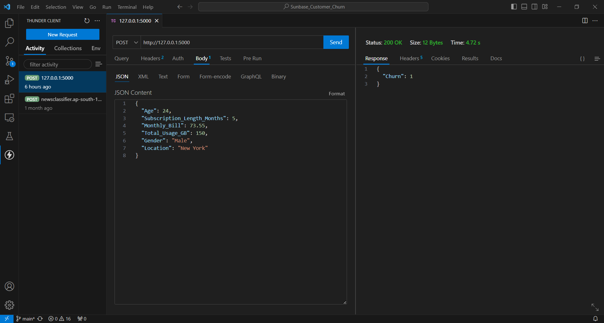

# Sunbase_Customer_Churn 🏃🏼‍♀️🏃🏼‍♂️💨

Customer Churn predicting ML model.  
Takes Age, Subscription_Length_Months, Monthly_Bill, Total_Usage_GB, Gender and Location as input and tells if the customer will churn or not.

Model training report is named **REPORT.md**.


## How to run ⚡

1. Clone this repository and move into the folder.
```bash
git clone https://github.com/ZenithFlux/Sunbase_Customer_Churn.git  
cd Sunbase_Customer_Churn
```

1. Install all dependencies.  
```bash
pip install -r requirements.txt
```

2. The model is deployed using flask. To run, type this in command line:  
```bash
flask --app application run
```

3. Now send a POST request to the server with input data in the request body having the following JSON format:
```json
{
  "Age": 24,
  "Subscription_Length_Months": 5,
  "Monthly_Bill": 73.55,
  "Total_Usage_GB": 150,
  "Gender": "Male",
  "Location": "New York"
}
```

**Note:** If you are running flask locally, then the server will most likely be at http://127.0.0.1:5000. Send the request on this address.

4. You will receive a JSON response in the following format:
```json
{"Churn": 1}
```  
This is the prediction done by the model.

## Example request (using Thunder Client) ⛈



## Deployment

This model was deployed on **AWS Elastic Beanstalk**, through continuous delivery from GitHub using **AWS CodePipeline**.

Due to high cost of running instances on AWS, this deployment is currently ***disabled***.

Screenshots:


